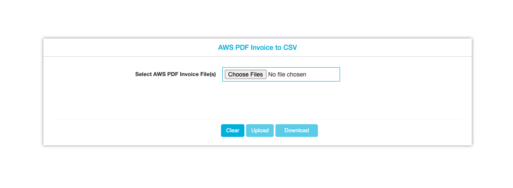

### AWS-Invoice-Converter


A Web Application used to extract data from multiple AWS PDF Invoices (especially Credit Memos) and convert them to a CSV file and store the extracted data in Database of our choice.

### ⚙️ Prerequisites

Make sure you have latest pip version `>= pip 19.3.1` and Install all the dependancies.

```
pip3 install -r requirements.txt
```



### 🛠 Crafted by

[ Aravind's LinkedIn](https://www.linkedin.com/in/engineeringwitharavind)

If you like this project or helped you in any way, show some love by giving it a ★ 😊
